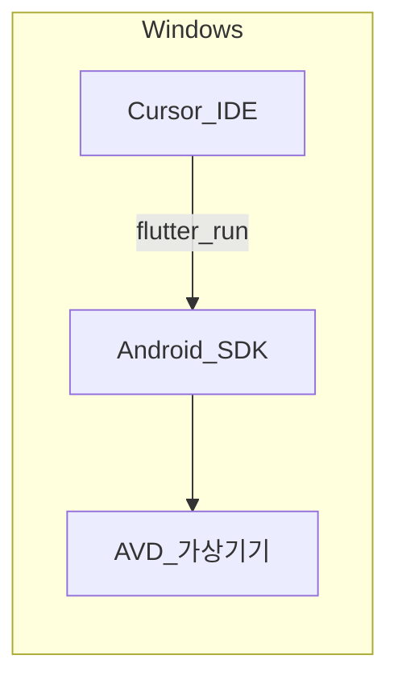

# Cursor 환경에서 Android 에뮬레이터 설치 가이드

## 핵심 개념 요약

1. **에뮬레이터는 Cursor 안에 “포함”되지 않습니다.** Android SDK의 `emulator`와 시스템 이미지가 Windows에 설치되고, Cursor 터미널의 `flutter run` 또는 디바이스 선택이 그 실행 파일을 찾습니다.
2. **가장 단순한 경로는 Android Studio 설치** 후 SDK Manager / AVD Manager로 구성 요소와 가상 기기(AVD)를 만드는 것입니다.

**비유:** Cursor는 “조종석”, Android 에뮬레이터는 별도 “시뮬레이터 장비”. 조종석에 화면만 띄우려면 장비를 먼저 거실(운영체제)에 설치하고 전원·케이블(`ANDROID_HOME`, PATH)을 맞춰야 합니다.



---

## 사전 확인 (Windows)

| 항목 | 설명 |
|------|------|
| 가상화 | BIOS/UEFI에서 **Intel VT-x / AMD-V** 활성화 권장. |
| Windows 기능 | **Windows 하이퍼바이저 플랫폼** 켜기(설정 → 앱 → 선택적 기능 → 추가 기능 → Windows 기능 켜기/끄기). Android Emulator는 주로 **Hyper-V / WHPX** 계열과 함께 동작합니다. |
| 충돌 | 과거 Intel HAXM과 Hyper-V 동시 사용 문제가 있었으나, 최신 Android Emulator는 WHPX 경로를 많이 사용합니다. 오류 시 Android Studio의 **SDK Tools**에서 **Android Emulator Hypervisor Driver** 설치 여부를 확인합니다. |

---

## 권장 경로: Android Studio로 설치

### 1) Android Studio 설치

- [Android Studio 다운로드](https://developer.android.com/studio) 공식 페이지에서 Windows용 설치 프로그램 실행.
- 설치 마법사에서 **Android SDK**, **Android SDK Platform**, **Android Virtual Device** 포함 여부를 확인(기본값으로 대부분 포함).

### 2) SDK 구성 요소 설치 (SDK Manager)

Android Studio → **More Actions** → **SDK Manager**(또는 상단 툴바).

- **SDK Platforms**: 타깃 API 하나 이상(예: 최신 안정 버전 또는 프로젝트의 `compileSdk`에 맞는 버전). Flutter는 보통 최신 안정 API와 함께 사용합니다.
- **SDK Tools** (필수에 가깝게 선택):
  - Android SDK Build-Tools
  - Android SDK Command-line Tools
  - Android Emulator
  - Android SDK Platform-Tools
  - (필요 시) Google Play 이미지용 관련 항목

프로젝트 참고: [android/](c:\Cursor\04_Flutter\toonflix\android) 폴더의 `build.gradle`에 지정된 `compileSdk`/`targetSdk`와 맞는 플랫폼을 설치하면 빌드 오류를 줄일 수 있습니다.

### 3) 가상 기기(AVD) 생성 (AVD Manager)

Android Studio → **Device Manager**(구 AVD Manager).

- **Create Device** → 폼 팩터 선택(Phone 등) → **시스템 이미지** 다운로드(x86_64 권장, Google APIs 또는 Play Store 필요 여부에 따라 선택) → 마법사 완료.

### 4) 환경 변수 (Cursor·터미널·Flutter 공통)

PowerShell 사용자 기준 예시(실제 SDK 경로는 설치 위치에 맞게 수정):

- `ANDROID_HOME` = `C:\Users\<사용자>\AppData\Local\Android\Sdk` (기본 경로일 때가 많음)
- **PATH**에 추가:
  - `%ANDROID_HOME%\platform-tools`
  - `%ANDROID_HOME%\emulator`
  - `%ANDROID_HOME%\cmdline-tools\latest\bin` (폴더명은 설치에 따라 `latest` 또는 버전 폴더)

설정 후 **새 터미널**을 열어야 Cursor에 반영됩니다.

### 5) 검증

Cursor에서 터미널을 열고:

```bash
flutter doctor -v
```

`Android toolchain`과 연결된 SDK 경로가 녹색/정상인지 확인합니다. 에뮬레이터 실행 후:

```bash
flutter devices
```

에뮬레이터가 목록에 나오면 [toonflix](c:\Cursor\04_Flutter\toonflix) 프로젝트에서:

```bash
cd c:\Cursor\04_Flutter\toonflix
flutter run
```

---

## 대안: Command-line Tools만 사용

Android Studio 없이 [commandlinetools](https://developer.android.com/studio#command-line-tools-only) ZIP을 `%ANDROID_HOME%\cmdline-tools\latest\` 구조에 풀고, `sdkmanager`로 `platform-tools`, `emulator`, `platforms;android-XX`, `system-images` 등을 설치한 뒤 `avdmanager`로 AVD를 생성할 수 있습니다. 유지보수는 Android Studio 경로보다 수동 작업이 많습니다.

---

## Cursor에서의 사용 방법

- **터미널**: 위 `flutter run`이 가장 일반적입니다.
- **확장**: [Dart](https://marketplace.visualstudio.com/items?itemName=Dart-Code.dart-code) / [Flutter](https://marketplace.visualstudio.com/items?itemName=Dart-Code.flutter) 확장 설치 시 상태 표시줄에서 디바이스 선택이 가능할 수 있습니다(에뮬레이터가 먼저 실행 중이어야 목록에 잘 뜸).

---

## 자주 있는 문제

1. **`adb` / `emulator`를 찾을 수 없음**: PATH와 `ANDROID_HOME` 오타, 터미널 재시작.
2. **에뮬레이터가 부팅만 하고 느림**: RAM/코어 할당 조정, cold boot vs snapshot, x86_64 이미지 사용.
3. **`flutter doctor`에서 Android 라이선스**: `flutter doctor --android-licenses` 실행 후 `y` 수락.
4. **Hyper-V / 가상화 관련 오류**: Windows 기능과 BIOS 가상화 재확인, Studio의 Emulator 진단 도구 참고.

---

## 다음 학습 추천

- **중급**: `compileSdk` / `targetSdk` / Gradle과 설치한 SDK 플랫폼 버전 맞추기 ([android/app/build.gradle.kts](c:\Cursor\04_Flutter\toonflix\android\app\build.gradle.kts) 또는 `build.gradle` 확인).
- **중급**: CI에서 에뮬레이터 없이 빌드만 검증하는 방법과 로컬 에뮬레이터 테스트 분리.
- **고급**: 프로파일링(DevTools)과 에뮬레이터 성능 튜닝.
