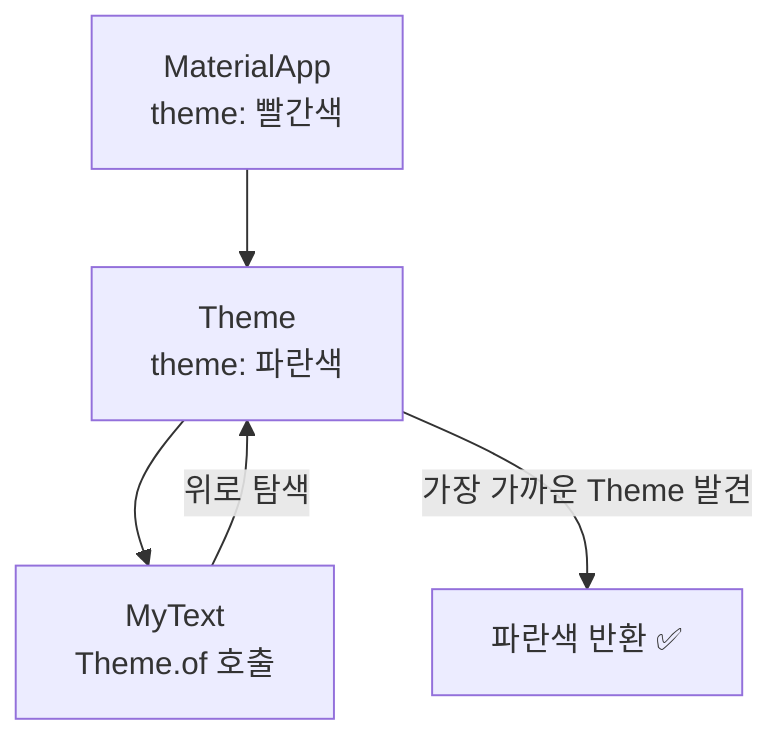
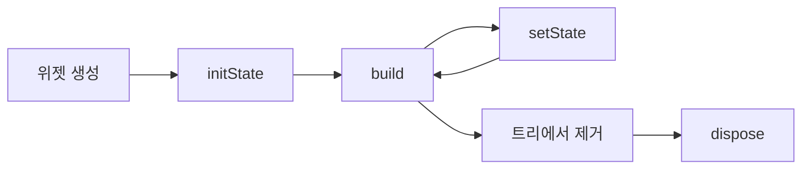

# 🎬 Toonflix

> **Flutter 웹툰 앱 만들기** — [노마드코더](https://nomadcoders.co) 강의 기반 학습 프로젝트

---

## 📁 파일별 설명

| 파일 | 설명 |
|------|------|
| `lib/widget_basic.dart` | Widget 제어를 위한 UI clone 연습 |
| `lib/stateful_basic.dart` | StatefulWidget, Theme, initState/dispose 생명주기 연습 |

---

## 📄 파일별 상세 내용

### `lib/widget_basic.dart`

금융 앱 UI를 클론하며 Flutter의 핵심 Widget을 학습하는 파일입니다.

---

#### 🧩 Widget별 개념 설명

| Widget | 역할 | 사용 예시 |
|--------|------|-----------|
| `MaterialApp` | Flutter 앱의 최상위 루트 위젯. Material Design 테마 및 라우팅 제공 | `return MaterialApp(home: ...)` |
| `Scaffold` | 화면의 뼈대. `body`, `appBar`, `floatingActionButton` 등 배치 | `Scaffold(backgroundColor: ..., body: ...)` |
| `Padding` | 자식 위젯의 주변에 여백 추가 | `Padding(padding: EdgeInsets.symmetric(...))` |
| `Column` | 자식 위젯들을 **세로**로 나열 | `Column(crossAxisAlignment: ..., children: [...])` |
| `Row` | 자식 위젯들을 **가로**로 나열 | `Row(mainAxisAlignment: ..., children: [...])` |
| `SizedBox` | 고정 크기의 빈 공간 (간격 조절용) | `SizedBox(height: 20)` |
| `Text` | 텍스트 표시. `TextStyle`로 폰트·색상·크기 지정 | `Text("Hello", style: TextStyle(...))` |
| `TextStyle` | Text의 스타일 지정 (color, fontSize, fontWeight 등) | `TextStyle(color: Colors.white, fontSize: 28)` |
| `Button` *(커스텀)* | `bgColor`, `textColor`, `text`를 파라미터로 받는 재사용 가능한 버튼 | `Button(text: "Transfer", bgColor: Colors.amber, ...)` |
| `CurrencyCard` *(커스텀)* | 통화 정보(name, code, amount, icon)를 표시하는 카드 위젯 | `CurrencyCard(name: "Euro", code: "EUR", ...)` |

---

#### 🏗️ 프로그램 구조

금융 앱 UI를 모방한 구조로, 아래와 같이 계층적으로 구성됩니다.

```
MaterialApp
└── Scaffold (검정 배경)
    └── Padding (좌우 여백 20)
        └── Column (세로 배치)
            ├── Row → Column (우측 정렬)
            │   ├── Text: "Hey, Selena"        ← 사용자 이름
            │   └── Text: "Welcome back"       ← 서브 문구
            ├── Text: "Total Balence"           ← 잔액 라벨
            ├── Text: "$5,194.69"               ← 잔액 금액
            ├── Row (양쪽 정렬)
            │   ├── Button: "Transfer"          ← 이체 버튼
            │   └── Button: "Request"           ← 요청 버튼
            ├── Row (양쪽 정렬)
            │   ├── Text: "Wallets"             ← 섹션 제목
            │   └── Text: "View All"            ← 전체보기
            ├── CurrencyCard: Euro / EUR / 6 428
            ├── CurrencyCard: Dollar / USD / 1 282
            └── CurrencyCard: Korean / KRW / 5 000
```

---

#### ⌨️ `Ctrl + .` 단축키 — Wrap Widget 기능

`Ctrl + .`는 커서를 Widget에 올려놓고 누르면 나타나는 **빠른 수정(Quick Fix)** 메뉴입니다.

대표적인 활용:

| 메뉴 항목 | 기능 |
|-----------|------|
| `Wrap with widget` | 임의의 Widget으로 감싸기 |
| `Wrap with Column` | Column으로 감싸기 |
| `Wrap with Row` | Row로 감싸기 |
| `Wrap with Center` | Center로 감싸기 |
| `Wrap with Padding` | Padding으로 감싸기 |
| `Remove this widget` | 해당 Widget만 제거하고 자식을 위로 끌어올리기 |

> Widget 구조를 직접 타이핑하지 않고, 기존 Widget을 빠르게 감싸거나 분리할 때 매우 유용합니다.

---

#### ▶️ `flutter run` vs `Start Debugging (▶)` 차이

| 구분 | `flutter run` (터미널) | `Start Debugging (▶)` |
|------|------------------------|------------------------|
| 실행 방식 | CLI 명령어 직접 입력 | IDE GUI 버튼 클릭 |
| 디버거 연결 | 기본적으로 연결 안 됨 | Dart 디버거 자동 연결 |
| 브레이크포인트 | 사용 불가 | 사용 가능 ✅ |
| Hot Reload | `r` 키 입력 | 저장 시 자동 적용 |
| Hot Restart | `R` 키 입력 | 툴바 버튼으로 실행 |
| 로그 출력 | 터미널에 직접 출력 | IDE Debug Console에 출력 |
| 속도 | 약간 빠름 | 디버거 오버헤드 있음 |
| 사용 시점 | 빠른 확인, 배포 직전 테스트 | 오류 추적, 변수 값 확인 |

> **학습 중에는 `▶ Start Debugging`을 권장** — 브레이크포인트와 변수 감시 기능으로 코드 흐름을 시각적으로 파악할 수 있습니다.

---

### `lib/stateful_basic.dart`

StatefulWidget의 생명주기(`initState`, `dispose`)와 Theme 시스템을 연습하는 파일입니다.

---

#### 🎨 Theme & TextTheme

`MaterialApp`의 `theme`으로 앱 전체 스타일을 설정하고, 하위 위젯은 `Theme.of(context)`로 참조합니다.

```dart
// _AppState — 전역 테마 설정
theme: ThemeData(
  textTheme: TextTheme(titleLarge: TextStyle(color: Colors.red)),
),

// _MyTextState — 테마 색상 참조
color: Theme.of(context).textTheme.titleLarge?.color,
```

**`Theme.of(context)` 동작 원리**

- `context`는 위젯 트리에서의 **위치 정보**
- 현재 위젯에서 **위로 올라가며** 가장 가까운 `Theme`을 찾아 반환
- 상위에 `Theme`이 2개 이상이면 **가장 가까운(nearest) 상위** 것을 사용



**TextTheme 역할 (Material Design 3)**

| 스타일 | 용도 | 기본 크기 |
|--------|------|-----------|
| `titleLarge` | AppBar 제목, 섹션 제목 | 22sp |
| `bodyLarge` | 본문, 목록 항목 | 16sp |

> 구버전 `headline6` → `titleLarge`, `bodyText1` → `bodyLarge`로 변경되었습니다.

---

#### 🔄 StatefulWidget 생명주기

`initState`와 `dispose`는 **StatefulWidget의 State 클래스**에서만 사용할 수 있습니다.

| 메서드 | 호출 시점 | 호출 횟수 |
|--------|-----------|-----------|
| `initState` | 위젯이 트리에 **처음 추가**될 때 | 1회 |
| `build` | 화면 렌더링, `setState` 호출 시 | 여러 번 |
| `dispose` | 위젯이 트리에서 **완전히 제거**될 때 | 1회 |



> `StatelessWidget`에는 `initState`/`dispose`가 없습니다. 생명주기가 필요하면 `StatefulWidget`으로 변경해야 합니다.

---

#### 👁️ Hide 버튼 — initState/dispose 확인하기

**핵심:** 위젯 **내부의 Text만 바꾸면** `build`만 재실행되고, `initState`/`dispose`는 호출되지 않습니다.  
위젯 **자체를 트리에서 넣고 빼야** 생명주기 메서드가 실행됩니다.

```dart
// ❌ MyText 내부에서 Text만 교체 → build만 출력됨
isHidden ? Text("Hidden") : Text("Click Counter")

// ✅ 부모(_AppState)에서 MyText 위젯 자체를 조건부 렌더링
isHidden ? const SizedBox() : const MyText()
```

**상태 끌어올리기 (State Lifting)**

`isHidden` 상태를 `MyText`가 아닌 부모 `_AppState`에서 관리합니다.

| 동작 | 콘솔 출력 |
|------|-----------|
| 앱 시작 | `Init` → `build` |
| Hide 버튼 클릭 (숨김) | `Dispose` |
| Hide 버튼 클릭 (다시 표시) | `Init` → `build` |

---

#### 🏗️ 프로그램 구조

```
MaterialApp (theme: titleLarge → 빨간색)
└── Scaffold
    └── Center
        └── Column
            ├── MyText (조건부)     ← isHidden ? SizedBox : MyText
            │   └── Text: "Click Counter"
            └── IconButton          ← hide() → isHidden 토글
```

---

#### 💡 참고 — `print` 파란 줄 (avoid_print)

`print("Init")` 등에 파란 줄이 표시되면 린터 규칙 `avoid_print` 힌트입니다. 오류가 아니며 앱 실행에는 영향 없습니다.

```dart
// 학습 중: print() 그대로 사용 가능
print("Init");

// 실전 권장: debugPrint() — 디버그 모드에서만 출력
debugPrint("Init");
```

---

#### 🚀 Flutter의 장점 3가지

**1. JIT + AOT 컴파일 동시 지원 (Flutter 엔진)**

- **JIT (Just-In-Time)**: 개발 중 Hot Reload를 가능하게 하여 코드 변경을 수 밀리초 안에 즉시 반영
- **AOT (Ahead-Of-Time)**: 릴리즈 빌드 시 네이티브 코드로 사전 컴파일하여 빠른 실행 속도 보장
- 하나의 코드베이스에서 개발 생산성과 런타임 성능을 모두 확보

**2. 단일 코드베이스로 6개 플랫폼 지원**

- iOS, Android, Web, Windows, macOS, Linux를 **하나의 Dart 코드**로 빌드
- 플랫폼별 별도 개발 없이 일관된 UI/UX 제공
- 유지보수 비용과 개발 인력을 대폭 절감

**3. Skia / Impeller 엔진 기반 자체 렌더링**

- 운영체제의 네이티브 UI 컴포넌트를 사용하지 않고, Flutter 자체 그래픽 엔진으로 **모든 픽셀을 직접 그림**
- 플랫폼에 관계없이 **완전히 동일한 UI**를 보장
- 60fps / 120fps 부드러운 애니메이션 구현이 용이

---

## 🛠️ 개발 환경

- Flutter SDK
- Dart
- IDE: Cursor / VS Code

## 📚 참고

- [노마드코더 Flutter 강의](https://nomadcoders.co)
- [Flutter 공식 문서](https://docs.flutter.dev)
